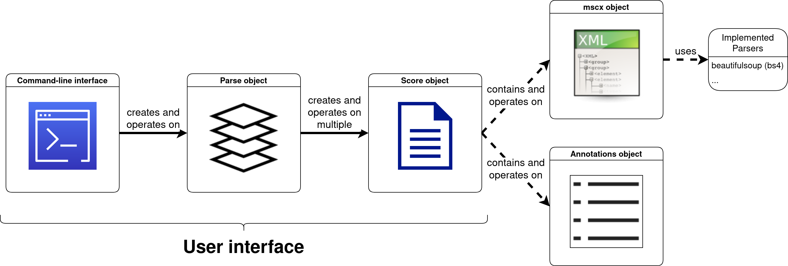

===============
Quick Reference
===============

There are two ways of interacting with ms3, namely using the commands that it installs to your system (such as
``ms3 extract``), or using its main objects, :py:class:`~ms3.score.Score` and :py:class:`~ms3.parse.Parse`, for example
in an interactive Python interpreter such as IPython, Jupyter, Google Colab, or just the console.

Parsing a single score: Working with the Score object
=====================================================

The example score is called ``stabat.mscx`` and can be downloaded from
`here <https://raw.githubusercontent.com/johentsch/ms3/master/docs/stabat.mscx>`__.

Creating a Score object
-----------------------

Simply pass the path to the MuseScore 3 file that you want to parse:

.. code-block:: python

    >>> from ms3 import Score
    >>> s = Score('~/ms3/docs/stabat.mscx')
    >>> s
        Uncompressed MuseScore file
        ---------------------------

        ~/ms3/docs/stabat.mscx

        Attached annotations
        --------------------

        48 labels:
        staff  voice  label_type  color_name
        3      2      0 (dcml)    default       48

As you see, upon inspecting the new object, the 48 detected labels are summarized. For the explanation of the various
label types, :ref:`see here <label_types>`.

A score object can also be created from a file that first needs to be converted (convertible format are, to date,
CAP, CAPX, MID, MIDI, MUSICXML, MXL), as long as you have MuseScore 3 installed on your computer:

.. code-block:: python

    >>> s = Score('stabat.mxl')
    ValueError: To open a mxl file, use 'ms3 convert' command or pass parameter 'ms' to Score to temporally convert.

Ooops, we also need to tell ms3 where it can find the MuseScore executable. If you are lucky, you can let ms3 go check
the default installation path for your system by trying ``Score('stabat.xml', ms='auto')``. Otherwise pass the path
to the executable. Linux users might want to use the `AppImage <https://musescore.org/en/download#AppImage-(recommended)>`__
which can be stored anywhere on the system.

Storing the labels
------------------

The annotations contained in a score are stored in an :py:class:`~ms3.annotations.Annotations` object and can be accessed
and stored as a tab-separated file (TSV) like this:

.. code-block:: python

    >>> s.annotations
    48 labels:
    staff  voice  label_type  color_name
    3      2      0 (dcml)    default       48

    >>> s.annotations.store_tsv('stabat_chords.tsv')
    True

.. _detaching:

Removing annotation labels
--------------------------

The annotations will be stored with a keyword that you choose. It needs to be different from ``'annotations'``.

.. caution::

  The parameter ``key`` will be deprecated from version 0.6.0 onwards. See :ref:`keys_and_ids`.

.. code-block:: python

    >>> s.detach_labels(key='chords')
    >>> s
    Uncompressed MuseScore file (CHANGED!!!)
    ----------------------------!!!!!!!!!!!!

    ~/ms3/docs/stabat.mscx

    No annotations attached.

    Detached annotations
    --------------------

    chords -> 48 labels:
    staff  voice  label_type  color_name
    3      2      0 (dcml)    default       48

Upon inspecting the object we see that the 48 labels are not attached to the score anymore. They are stored in a new
:py:class:`~ms3.annotations.Annotations` object which can be accessed via ``s.chords``, i.e. the key we've chosen.
The warning ``CHANGED!!!`` does not mean that the file on disc has been changed, only the object. Overwriting
the original file could mean a loss of the labels unless they are stored separately.

Storing the changed score
-------------------------

To output the changed score without the labels, choose a different path unless you really want to overwrite the annotated file.
The output will always be uncompressed, so make sure to use ``.mscx`` as extension, not ``.mscz``.

.. code-block:: python

    >>> s.store_mscx('stabat_empty.mscx')
    True

Adding labels to score
----------------------

The method :py:meth:`~ms3.score.Score.attach_labels` can be used to re-attach a set of labels that has been
:ref:`detached<detaching>`. Similarly we can load the empty score and the stored labels to reunite them:

.. code-block:: python

    >>> e = Score('stabat_empty.mscx')
    >>> e.load_annotations('stabat_chords.tsv', key='tsv_chords')
    >>> e
    Uncompressed MuseScore file
    ---------------------------

    ~/ms3/docs/stabat_empty.mscx

    No annotations attached.

    Detached annotations
    --------------------

    tsv_chords (stored as stabat_chords.tsv) -> 48 labels:
    staff  voice  label_type  color_name
    3      2      0 (dcml)    default       48

    >>> e.attach_labels(key='tsv_chords', voice=1, label_type=1)
    >>> e.store_mscx('stabat_rna.mscx')
    >>> e
    Uncompressed MuseScore file (CHANGED!!!)
    ----------------------------!!!!!!!!!!!!

    ~/ms3/docs/stabat_empty.mscx

    Attached annotations
    --------------------

    48 labels:
    staff  voice  label_type  color_name
    3      1      1           default       48

.. caution::

  The parameter ``key`` will be deprecated from version 0.6.0 onwards. See :ref:`keys_and_ids`.

As we can see, the parameter ``voice=1`` has been used to insert the labels in the first layer (coloured blue in MuseScore)
of staff 3 when originally they had been attached to layer two (coloured in green in the software). Additionally,
the parameter ``label_type=1`` resulted in the labels being attached to MuseScore's Roman Numeral Analysis layer
(for information on the various label types, :ref:`see here <label_types>`). If you followed the steps above,
you may open the new file ``stabat_rna.mscx`` to inspect the result.

Accessing score information
---------------------------

After parsing a score, all contained information is accessible in structured formats. Most information is returned as
:obj:`pandas.DataFrame`, whereas a given set of metadata is accessible as dictionary.

Since this information is attached to the parsed MSCX file (and not, say, to loaded annotations), it is accessible
via ``s.mscx``.

Metadata
^^^^^^^^

The metadata contains the data that can be accessed and altered in MuseScore 3 through the menu ``File -> Score Properties``
as well as information computed from the score, such as the names and ambitus of the contained staves. Note that the
ambitus in the example here pertain to the first page only.

.. code-block:: python

    >>> from ms3 import Score
    >>> s = Score('~/ms3/docs/stabat.mscx')
    >>> s.mscx.metadata
    {'arranger': '',
     'composer': 'Giovanni Battista Pergolesi',
     'copyright': 'Editions FREDIPI',
     'creationDate': '2019-07-23',
     'lyricist': '',
     'movementNumber': '1',
     'movementTitle': 'Stabat Mater dolorosa',
     'platform': 'Microsoft Windows',
     'poet': '',
     'source': 'http://musescore.com/user/1630246/scores/5653570',
     'translator': 'fredipi',
     'workNumber': '',
     'workTitle': 'Stabat Mater',
     'musescore': '3.5.0',
     'last_mc': 13,
     'last_mn': 13,
     'label_count': 48,
     'TimeSig': {1: '4/4'},
     'KeySig': {1: -4},
     'annotated_key': 'f',
     'parts': {'part_1': {'staves': [1],
       'trackName': 'Soprano',
       'longName': 'Soprano',
       'instrument': 'Soprano',
       'staff_1_ambitus': {'min_midi': 65,
        'min_name': 'F4',
        'max_midi': 70,
        'max_name': 'Bb4'}},
      'part_2': {'staves': [2],
       'trackName': 'Alto',
       'longName': 'Alto',
       'instrument': 'Alto',
       'staff_2_ambitus': {'min_midi': 64,
        'min_name': 'E4',
        'max_midi': 68,
        'max_name': 'Ab4'}},
      'part_3': {'staves': [3, 4],
       'trackName': 'Piano',
       'longName': 'Violino I/II\nViola\nVioloncello\nContrabasso\ne organo',
       'instrument': 'Piano',
       'staff_3_ambitus': {'min_midi': 56,
        'min_name': 'Ab3',
        'max_midi': 85,
        'max_name': 'Db6'},
       'staff_4_ambitus': {'min_midi': 44,
        'min_name': 'Ab2',
        'max_midi': 70,
        'max_name': 'Bb4'}}},
     'ambitus': {'min_midi': 44,
      'min_name': 'Ab2',
      'max_midi': 85,
      'max_name': 'Db6'}}

The computed information contains the following:

* ``last_mc/last_mn``: Last measure number and measure count (see :ref:`here<mc_vs_mn>` to learn the difference).
* ``TimeSig/KeySig``: Time signatures and key signatures, each given as a dictionary with measure counts as keys.
* ``annotated_key``: Only included if the first annotation label in the score starts with a key such as ``Ab`` or ``f#``.
* ``parts``: contain several inner dictionaries: parts -> partname -> staves -> ambitus. For example, the dictionary
    for the piano part contains staves 3 and for, one for the right hand (Ab3-Db6) and one for the left hand (Ab2-Bb4).
* ``musescore``: The MuseScore version with which the files has been saved.

.. _tabular_info:

Tabular information
^^^^^^^^^^^^^^^^^^^

All score information, except the metadata, is contained in the following two tables:

* ``measures``: A list of all measures together with the strictly increasing **measure counts (MC)** mapped to the actual
  **measure numbers (MN)**. Read more on the difference in the :ref:`manual<mc_vs_mn>`.
* ``events``: A raw version of the score where the XML tags of all events have been transformed to column names.

However, ``events`` tables are very cumbersome to work with, which is why you might be interested in the following pretty and
standardized tables:

* ``notes``: A list of all notes contained in the score together with their respective features.
* ``rests``: A list of all rests contained in the score together with their respective features.
* ``notes_and_rests``: A combination of the two.
* ``chords``: Not to be confounded with labels or chord annotations, a chord is a notational unit in which all included
  notes are part of the same notational layer and have the same onset. Every chord has a ``chord_id`` and every note
  is part of a chord. These tables are used to convey score information that is not attached to a particular note,
  such as lyrics, staff text, dynamics and other markup.
* ``labels``: The annotation labels contained in the score, formatted according to :py:attr:`.MSCX.labels_cfg`.
* ``expanded``: If the score contains `DCML harmony labels <https://github.com/DCMLab/standards>`__, return them split
  into the encoded features.
* ``cadences``: If DCML harmony labels include cadence labels, return only those (simply a filter on ``expanded``).

In order to retrieve any of these tables, simply call the corresponding property from ``Score.mscx``, e.g.

.. code-block:: python

    >>> from ms3 import Score
    >>> s = Score('~/ms3/docs/stabat.mscx')
    >>> s.mscx.labels

.. program-output:: python examples/access_score_info.py

Parsing multiple scores
=======================

Often we want to perform operations on many scores at once, for example extracting the notelist of each and store it as
a tab-separated values file (TSV).

Loading
-------

The first step is to create a :py:class:`~ms3.parse.Parse` object. When passing it
the path of the cloned `Git <https://github.com/johentsch/ms3>`__, it scans it for all MSCX files:

.. code-block:: python

    >>> from ms3 import Parse
    >>> p = Parse('~/ms3')
    >>> p
    10 files.
    KEY       -> EXTENSIONS
    docs      -> {'.mscx': 4}
    tests/MS3 -> {'.mscx': 6}

As we see, different keys have been automatically assigned for the different folders because no key has been specified.
Instead, we could assign all ten files to the same key and then add the 'docs' once more with a different key:

.. code-block:: python

    >>> p = Parse('~/ms3', key='all')
    >>> p.add_dir('~/ms3/docs', key='doubly')
    >>> p
    14 files.
    KEY    -> EXTENSIONS
    all    -> {'.mscx': 10}
    doubly -> {'.mscx': 4}

.. caution::

  The parameter ``key`` will be deprecated from version 0.6.0 onwards. See :ref:`keys_and_ids`.

Parsing
-------

... is as simple as

.. code-block:: python

    >>> p.parse_mscx()
    WARNING Did03M-Son_regina-1762-Sarti -- bs4_measures.py (line 152) check_measure_numbers():
	    MC 94, the 1st measure of a 2nd volta, should have MN 93, not MN 94.

Voilà, parsed in parallel with only one warning where a score has to be corrected. The parsed
:py:class:`~ms3.score.Score` objects (:ref:`read_only`) are stored in the dictionary
:py:attr:`~ms3.parse.Parse._parsed`, the state of which can be viewed like this:

.. code-block:: python

    >>> p.parsed
    {('all', 0): '~/ms3/docs/cujus.mscx -> 88 labels',
     ('all', 1): '~/ms3/docs/o_quam.mscx -> 26 labels',
     ('all', 2): '~/ms3/docs/quae.mscx -> 79 labels',
     ('all', 3): '~/ms3/docs/stabat.mscx -> 48 labels',
     ('all', 4): '~/ms3/tests/MS3/05_symph_fant.mscx',
     ('all', 5): '~/ms3/tests/MS3/76CASM34A33UM.mscx -> 173 labels',
     ('all', 6): '~/ms3/tests/MS3/BWV_0815.mscx',
     ('all', 7): '~/ms3/tests/MS3/D973deutscher01.mscx',
     ('all', 8): '~/ms3/tests/MS3/Did03M-Son_regina-1762-Sarti.mscx -> 193 labels',
     ('all', 9): '~/ms3/tests/MS3/K281-3.mscx -> 375 labels',
     ('doubly', 0): '~/ms3/docs/cujus.mscx -> 88 labels',
     ('doubly', 1): '~/ms3/docs/o_quam.mscx -> 26 labels',
     ('doubly', 2): '~/ms3/docs/quae.mscx -> 79 labels',
     ('doubly', 3): '~/ms3/docs/stabat.mscx -> 48 labels'}

Extracting score information
----------------------------

Each of the :ref:`previously discussed DataFrames<tabular_info>` can be automatically stored for every score. To select
one or several aspects from ``[notes, measures, rests, notes_and_rests, events, labels, chords, expanded]``, it is enough
to pass the respective ``_folder`` parameter to :py:meth:`~ms3.parse.Parsed.store_lists` distinguishing where to store
the TSV files. Additionally, the method accepts one ``_suffix`` parameter per aspect, i.e. a slug added to the respective
filenames. If the parameter ``simulate=True`` is passed, no files are written but the file paths to be created are returned.

In this variant, all aspects are stored each in individual folders but with identical filenames:

.. code-block:: python

    >>> p = Parse('~/ms3/docs', key='pergo')
    >>> p.parse_mscx()
    >>> p.store_lists(  notes_folder='./notes',
                        rests_folder='./rests',
                        notes_and_rests_folder='./notes_and_rests',
                        simulate=True
                        )
    ['~/ms3/docs/notes/cujus.tsv',
     '~/ms3/docs/rests/cujus.tsv',
     '~/ms3/docs/notes_and_rests/cujus.tsv',
     '~/ms3/docs/notes/o_quam.tsv',
     '~/ms3/docs/rests/o_quam.tsv',
     '~/ms3/docs/notes_and_rests/o_quam.tsv',
     '~/ms3/docs/notes/quae.tsv',
     '~/ms3/docs/rests/quae.tsv',
     '~/ms3/docs/notes_and_rests/quae.tsv',
     '~/ms3/docs/notes/stabat.tsv',
     '~/ms3/docs/rests/stabat.tsv',
     '~/ms3/docs/notes_and_rests/stabat.tsv']

.. caution::

  The parameter ``key`` will be deprecated from version 0.6.0 onwards. See :ref:`keys_and_ids`.

In this variant, the different ways of specifying folders are exemplified. To demonstrate all subtleties we parse the
same four files but this time from the perspective of ``~/ms3``:

.. code-block:: python

    >>> p = Parse('~/ms3', folder_re='docs', key='pergo')
    >>> p.parse_mscx()
    >>> p.store_lists(  notes_folder='./notes',
                        measures_folder='../measures',
                        rests_folder='rests',
                        labels_folder='~/labels',
                        expanded_folder='~/labels', expanded_suffix='_exp',
                        simulate = True
                        )
    ['~/ms3/docs/notes/cujus.tsv',
     '~/ms3/rests/docs/cujus.tsv',
     '~/ms3/measures/cujus.tsv',
     '~/labels/cujus.tsv',
     '~/labels/cujus_exp.tsv',
     '~/ms3/docs/notes/o_quam.tsv',
     '~/ms3/rests/docs/o_quam.tsv',
     '~/ms3/measures/o_quam.tsv',
     '~/labels/o_quam.tsv',
     '~/labels/o_quam_exp.tsv',
     '~/ms3/docs/notes/quae.tsv',
     '~/ms3/rests/docs/quae.tsv',
     '~/ms3/measures/quae.tsv',
     '~/labels/quae.tsv',
     '~/labels/quae_exp.tsv',
     '~/ms3/docs/notes/stabat.tsv',
     '~/ms3/rests/docs/stabat.tsv',
     '~/ms3/measures/stabat.tsv',
     '~/labels/stabat.tsv',
     '~/labels/stabat_exp.tsv']

.. caution::

  The parameter ``key`` will be deprecated from version 0.6.0 onwards. See :ref:`keys_and_ids`.

The rules for specifying the folders are as follows:

* absolute folder (e.g. ``~/labels``): Store all files in this particular folder without creating subfolders.
* relative folder starting with ``./`` or ``../``: relative folders are created
  "at the end" of the original subdirectory structure, i.e. relative to the MuseScore
  files.
* relative folder not starting with ``./`` or ``../`` (e.g. ``rests``): relative
  folders are created at the top level (of the original directory or the specified
  ``root_dir``) and the original subdirectory structure is replicated
  in each of them.

To see examples for the three possibilities, see :ref:`specifying_folders`.
